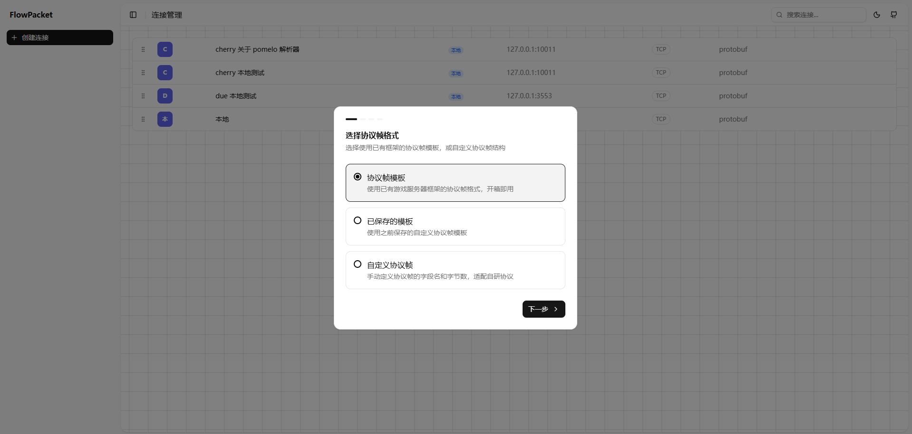
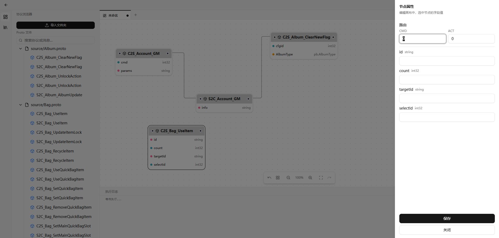

# LinkWeaver

English | [涓枃](./README_CN.md)

A canvas-based testing tool for custom protocol frames, supporting multiple network protocols and encoding formats.

## 馃 Why LinkWeaver

The nature of game servers makes common testing tools impractical:

- **Custom Long-Connection Protocols**

  To deliver a better gaming experience, game servers typically communicate over long-lived connections such as TCP, WebSocket, and KCP. Most API testing tools are built around HTTP and cannot interface with these protocols or custom binary frames

- **Test Cases Are Hard to Manage**

  Traditionally, testing means writing a `Client.go` with handcrafted send/receive logic. As test scenarios grow, the file bloats 鈥?you constantly add new functions, comment out unused cases, and uncomment them to switch targets. Game workflows are often multi-step and sequential (e.g., create a character, then enter the game), so verifying just a few steps requires repeatedly commenting and restoring prerequisites 鈥?the management overhead far exceeds the writing effort

- **Lack of Proto Encoding Support**

  Game servers widely use Protobuf for serialization, yet few API testing tools offer native Proto support. Extra plugins or manual conversion make the workflow cumbersome

- **Need to Test Through the Gateway**

  Game servers need to test not only request-response logic but also server-initiated push notifications. These notification capabilities are provided by the gateway 鈥?connecting directly to a game node only yields one-to-one responses and cannot verify whether push notifications are delivered correctly

LinkWeaver solves these problems with a **visual canvas** 鈥?model protocol messages as nodes, define execution order with connections, and run complete test flows in a WYSIWYG manner.

## 馃憖 Preview


<details>
<summary>Custom Protocol Frame</summary>


</details>

<details>
<summary>Reusable Templates</summary>


</details>

<details>
<summary>Save Canvas</summary>


</details>

<details>
<summary>Custom Request Parameters</summary>


</details>

## 鉁?Key Features

- Custom header protocol frames
- Drag-and-drop canvas to build test cases
- Import and parse Proto files
- Proto / JSON encoding and decoding
- TCP / WebSocket long connections
- Built-in support for popular game frameworks: Cherry / Due / Pomelo protocol frames

## 馃殌 Getting Started

Download the installer from the release page: [Release page](https://github.com/guowei-gong/flow-packet/releases)

## 馃敤 Build from Source

```bash
# Prerequisites: Node.js 18+, Go 1.21+

# Install frontend dependencies
cd apps/renderer && npm install

# Development mode
npm run dev

# Run backend
cd apps/server/cmd/flow-packet/main.go
```

## 馃洜 Tech Stack

| Layer    | Technology         |
|----------|--------------------|
| Frontend | React + TypeScript |
| Canvas   | React Flow         |
| Desktop  | Electron           |
| Backend  | Go                 |

## 馃憢 Contact

WeChat: ggw1315

## 馃崏 Acknowledgments

- Thanks to the [LINUX DO](https://linux.do/) community's open-source showcase for helping more people discover LinkWeaver

