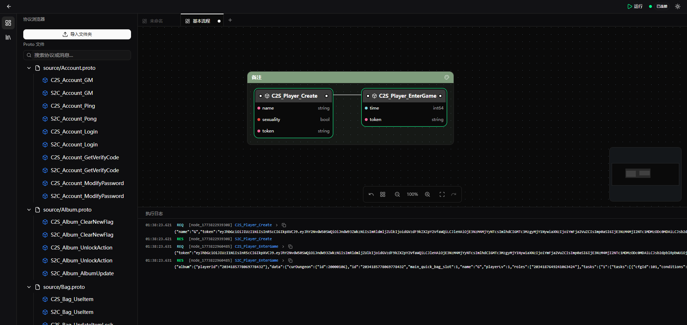
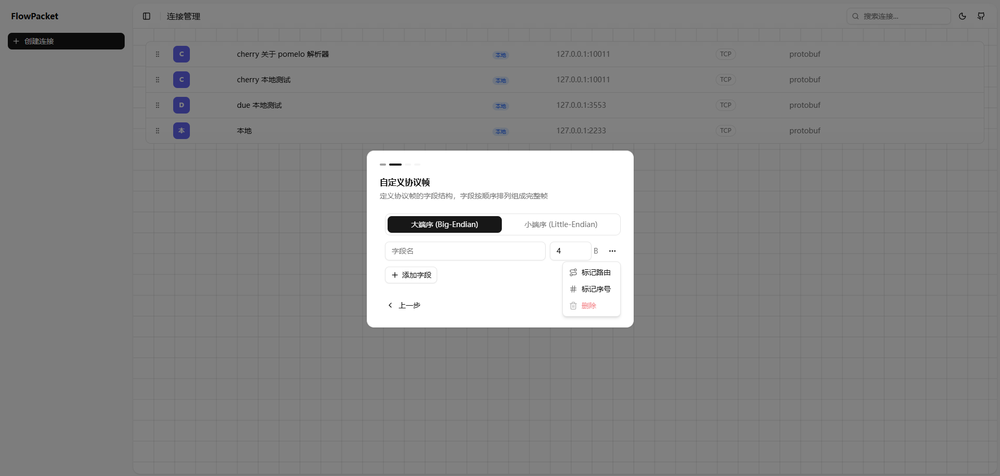

# LinkWeaver

[English](./README.md) | 涓枃

涓€娆捐嚜瀹氫箟鍗忚甯х殑鐢诲竷娴嬭瘯宸ュ叿锛屾敮鎸佸绉嶇綉缁滃崗璁拰缂栫爜鏂瑰紡銆?

## 馃 涓轰粈涔堥渶瑕?LinkWeaver

娓告垙鏈嶇殑鐗规€э紝瀵艰嚧浣跨敤甯歌鐨勬祴璇曞伐鍏锋椂瀛樺湪涓€浜涢殰纰嶏細

- **鑷畾涔夐暱杩炴帴鍗忚**

  涓轰簡璁╃帺瀹惰幏寰楁洿濂界殑娓告垙浣撻獙锛屾父鎴忔湇閫氬父閲囩敤 TCP銆乄ebSocket銆並CP 绛夐暱杩炴帴閫氫俊銆傚ぇ澶氭暟 API 娴嬭瘯宸ュ叿鍥寸粫 HTTP 璁捐锛屾棤娉曠洿鎺ュ鎺ヨ繖浜涘崗璁拰鑷畾涔夌殑浜岃繘鍒跺崗璁抚

- **娴嬭瘯鐢ㄤ緥闅句互绠＄悊**

  浠ュ線娴嬭瘯閫氬父鏄墜鍐欎竴涓?`Client.go`锛屽湪閲岄潰缂栧啓鍙戦€佸拰鐩戝惉閫昏緫銆傞殢鐫€娴嬭瘯鍦烘櫙瓒婃潵瓒婂锛屾枃浠朵笉鏂啫鑳€锛岄渶瑕侀绻佸湴鏂板鍑芥暟銆佹敞閲婃帀鏆傛椂涓嶇敤鐨勭敤渚嬶紝鍐嶅彇娑堟敞閲婃潵鍒囨崲娴嬭瘯鐩爣銆傝€屾父鎴忎笟鍔″線寰€鏄姝ラ涓旀湁搴忕殑锛堝鍏堝垱寤鸿鑹诧紝鍐嶈繘鍏ユ父鎴忥級锛屾瘡娆″彧鎯抽獙璇佹祦绋嬩腑鐨勬煇鍑犳鏃讹紝灏卞緱鍙嶅娉ㄩ噴鍜屾仮澶嶅墠缃楠も€斺€旂鐞嗘垚鏈繙澶т簬缂栧啓鎴愭湰

- **Proto 缂栫爜鏀寔缂哄け**

  娓告垙鏈嶆櫘閬嶄娇鐢?Protobuf 浣滀负搴忓垪鍖栨柟妗堬紝浣嗗父瑙佺殑 API 娴嬭瘯宸ュ叿瀵?Proto 缂栫爜鐨勬敮鎸侀潪甯告湁闄愶紝寰€寰€闇€瑕侀澶栫殑鎻掍欢鎴栨墜鍔ㄨ浆鎹紝娴佺▼绻佺悙

- **闇€瑕侀潰鍚戠綉鍏宠幏鍙栫湡瀹炵粨鏋?*

  娓告垙鏈嶄笉浠呴渶瑕佹祴璇曡姹?鍝嶅簲鐨勪笟鍔￠€昏緫锛岃繕闇€瑕侀獙璇佹湇鍔＄涓诲姩鎺ㄩ€佺殑閫氱煡鏄惁姝ｅ父銆傝繖浜涢€氱煡鑳藉姏鐢辩綉鍏虫彁渚涳紝濡傛灉鐩存帴杩炴帴娓告垙鑺傜偣锛屽彧鑳芥嬁鍒颁竴瀵逛竴鐨勫搷搴旓紝鏃犳硶楠岃瘉閫氱煡鎺ㄩ€佹槸鍚︽纭埌杈?

LinkWeaver 閫氳繃**鍙鍖栫敾甯?*瑙ｅ喅浠ヤ笂闂鈥斺€斿皢鍗忚娑堟伅寤烘ā涓鸿妭鐐癸紝鐢ㄨ繛绾垮畾涔夋墽琛岄『搴忥紝鎵€瑙佸嵆鎵€寰楀湴缂栨帓鍜岃繍琛屽畬鏁寸殑鍩烘湰娴嬭瘯娴佺▼銆?

## 馃憖 棰勮




<details>
<summary>鑷畾涔夊崗璁抚</summary>


</details>

<details>
<summary>妯℃澘鍙鐢?/summary>


## 馃敤 浠庢簮鐮佹瀯寤?

```bash
# 鍓嶇疆渚濊禆锛歂ode.js 18+, Go 1.21+

# 瀹夎鍓嶇渚濊禆
cd apps/renderer && npm install

# 寮€鍙戞ā寮?
npm run dev

# 杩愯鍚庣
cd apps/server/cmd/flow-packet/main.go
```

## 馃洜 鎶€鏈爤

| 灞? | 鎶€鏈?                |
|----|--------------------|
| 鍓嶇 | React + TypeScript |
| 鐢诲竷 | React Flow         |
| 妗岄潰 | Electron           |
| 鍚庣 | Go                 |

## 馃憢 浜ゆ祦涓庤璁?

涓汉寰俊锛歡gw1315

## 馃崏 鍏朵粬

- 鎰熻阿 [LINUX DO](https://linux.do/) 绀惧尯鐨?`寮€婧愯嚜鑽恅 妯″潡璁╂洿澶氭湅鍙嬩簡瑙?FlowPacet 宸ュ叿

